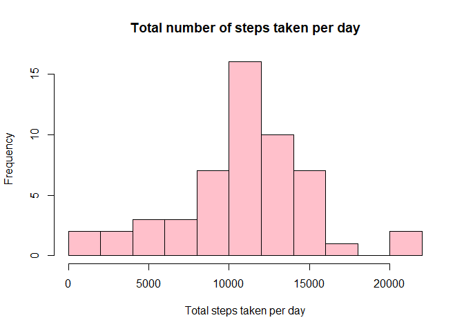
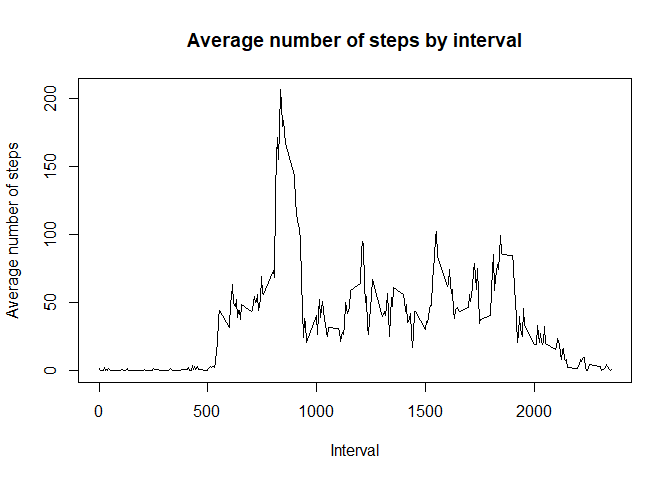
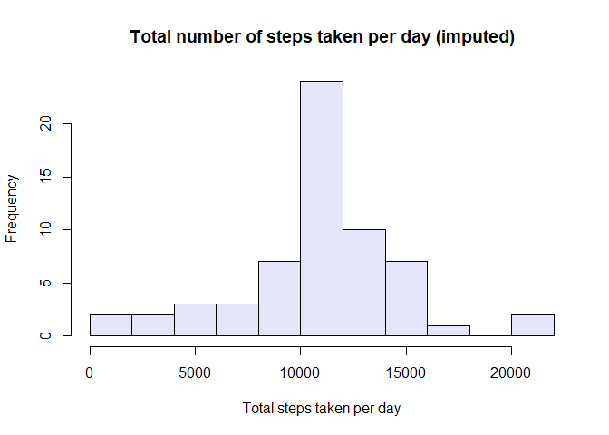

## Loading and preprocessing the data
Show any code that is needed to

1. Load the data (i.e. read.csv file).
2. Process/transform the data (if necessary) into a format suitable for your analysis.


```r
# Load data.table library
library(data.table)
```

```
## Warning: package 'data.table' was built under R version 3.5.3
```

```r
# Read the file as data table
act <- data.table(read.csv("activity.csv")) 
```


## What is the mean total number of steps taken per day?
1. Calculate the total number of steps taken per day.
2. Make a histogram of the total number of steps taken each day.
3. Calculate and report the mean and median total number of steps taken per day.


```r
#Omit NA values first
act_omit <- na.omit(act)

# Calculate total steps taken per day
totalsteps <- rowsum(act_omit$steps, format(act_omit$date)) 
```


```r
# Create a histogram of the total number or steps taken per day
hist(totalsteps, breaks=10, main="Total number of steps taken per day", xlab="Total steps taken per day", col="pink")
```

<!-- -->


```r
# Calculate the mean
mean(totalsteps)
```

```
## [1] 10766.19
```

```r
# Calculate the median
median(totalsteps)
```

```
## [1] 10765
```


## What is the average daily activity pattern?
1. Make a time series plot (i.e. type = "l") of the 5-minute interval (x-axis) and the average number of steps taken, averaged across all days (y-axis).


```r
# Load dplyr package to use the group_by() and summarize() functions
library(dplyr) 
```

```
## Warning: package 'dplyr' was built under R version 3.5.3
```

```
## 
## Attaching package: 'dplyr'
```

```
## The following objects are masked from 'package:data.table':
## 
##     between, first, last
```

```
## The following objects are masked from 'package:stats':
## 
##     filter, lag
```

```
## The following objects are masked from 'package:base':
## 
##     intersect, setdiff, setequal, union
```

```r
# Group the activity dataset by the 'interval' variable
group_interval <- group_by(act_omit, interval) 

# Obtain the mean number of steps for each 5-min interval
intsteps <- summarize(group_interval, mean(steps))

# Plot the average number of steps by interval
plot(intsteps, type="l", main ="Average number of steps by interval", xlab="Interval", ylab="Average number of steps")
```

<!-- -->


2. Which 5-minute interval, on average across all the days in the dataset, contains the maximum number of steps?

```r
# Arrange the data in descending order of the highest average steps
arrange(intsteps, desc(`mean(steps)`))
```

```
## # A tibble: 288 x 2
##    interval `mean(steps)`
##       <int>         <dbl>
##  1      835          206.
##  2      840          196.
##  3      850          183.
##  4      845          180.
##  5      830          177.
##  6      820          171.
##  7      855          167.
##  8      815          158.
##  9      825          155.
## 10      900          143.
## # ... with 278 more rows
```
**Answer:** The 5-minute interval with the maximum number of average steps is  **835**  and the number of steps for that interval is  206.


## Imputing missing values
1. Calculate and report the total number of missing values in the dataset (i.e. the total number of rows with NAs).
2. Devise a strategy for filling in all of the missing values in the dataset. 
3. Create a new dataset that is equal to the original dataset but with the missing data filled in.
4. Make a histogram of the total number of steps taken each day and Calculate and report the mean and median total number of steps taken per day. Do these values differ from the estimates from the first part of the assignment? What is the impact of imputing missing data on the estimates of the total daily number of steps?


```r
# Total number of rows with NAs)
sum(is.na(act$steps))
```

```
## [1] 2304
```


```r
# Replacing NA values with the mean number of steps
act$steps[is.na(act$steps)] <- mean(act$steps, na.rm = TRUE)

# Calculate the total steps taken per day after replacing the NA values with the mean number of steps
totalsteps2 <- rowsum(act$steps, format(act$date)) 

# Make a histogram of the total number of steps taken each day (imputed)
hist(totalsteps2, breaks=10, main="Total number of steps taken per day (imputed)", xlab="Total steps taken per day", col="lavender")
```

<!-- -->


```r
# Calculate the new mean
mean(totalsteps2)
```

```
## [1] 10766.19
```

```r
# Calculate the new median
median(totalsteps2)
```

```
## [1] 10766.19
```


```r
# Check for differences in the values between the imputed estimates and the earlier estimates
round(mean(totalsteps2) - mean(totalsteps))
```

```
## [1] 0
```

```r
round(median(totalsteps2) - median(totalsteps))
```

```
## [1] 1
```

The **mean has not changed** while the **median demonstrated only a slight difference** after imputing the missing values. This is most likely because the missing values were replaced with that of the average of the whole dataset.   


## Are there differences in activity patterns between weekdays and weekends? 
1. Create a new factor variable in the dataset with two levels -- "weekday" and "weekend" indicating whether a given date is a weekday or weekend day.
2. Make a panel plot containing a time series plot (i.e. type = "l") of the 5-minute interval (x-axis) and the average number of steps taken, averaged across all weekday days or weekend days (y-axis). 


```r
# Add a new variable to the activity dataset with two levels -- "weekday" and "weekend" -- to indicate whether a given date is a weekday or weekend day
weekday.or.weekend <- function(date) {
    day <- weekdays(date)
    if (day %in% c("Monday", "Tuesday", "Wednesday", "Thursday", "Friday")) 
        return("weekday") else if (day %in% c("Saturday", "Sunday")) 
        return("weekend") else stop("invalid date")
}
act$date <- as.Date(act$date)
act$day <- sapply(act$date, FUN = weekday.or.weekend)
```


```r
# Create a plot to demonstrate the average number of steps taken on weekdays and weekends
library(lattice)
panel_days <- aggregate(steps ~ interval + day, data=act, mean)
with(panel_days,
     xyplot(steps ~ interval | day, type="l", xlab = "Interval", ylab = "Number of steps", layout = c(1, 2)))
```

<!-- -->

We can observe subtle differences between the average number of steps taken on weekdays and weekends. On weekdays, the user appears to start moving earlier in the day, possibly due to commute to work. In contrast, the user starts his/her day later on weekends.
